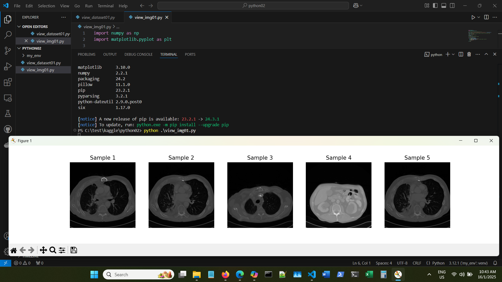
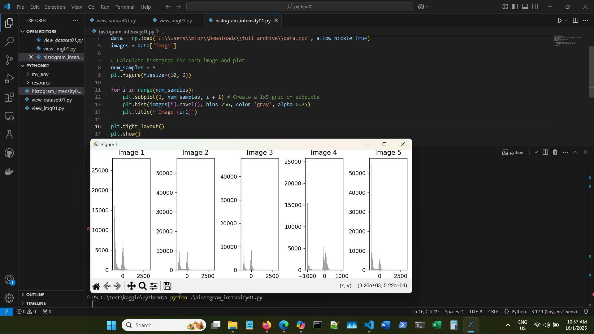
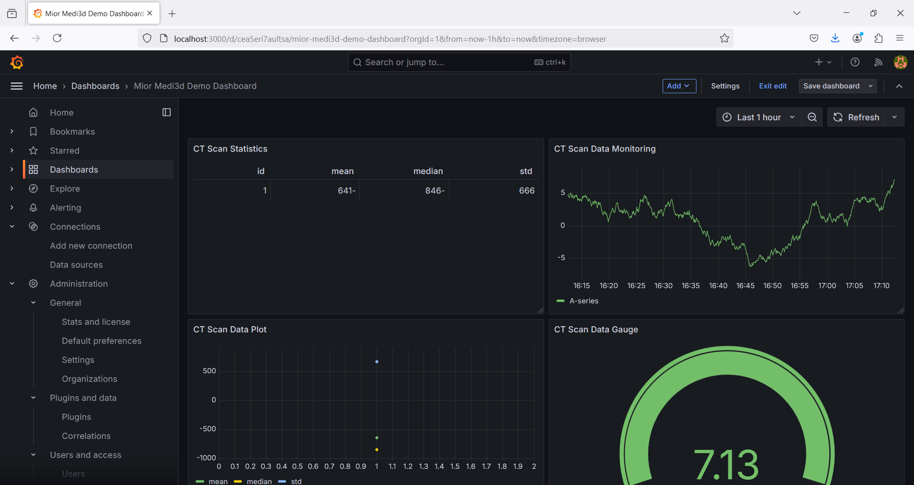

# Medi3d

This project utilizes a medical CT scan dataset to create 3D models for 3D printing applications. The goal is to process and convert CT scan data into 3D printable models, which can be used in various medical fields for educational purposes, pre-surgical planning, or prosthetics design.

## Visualization

## *Author*
Mior

